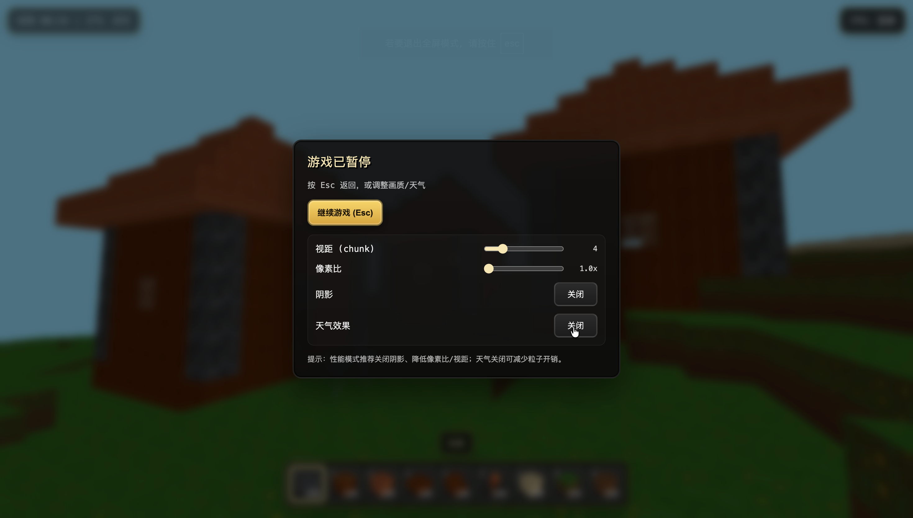
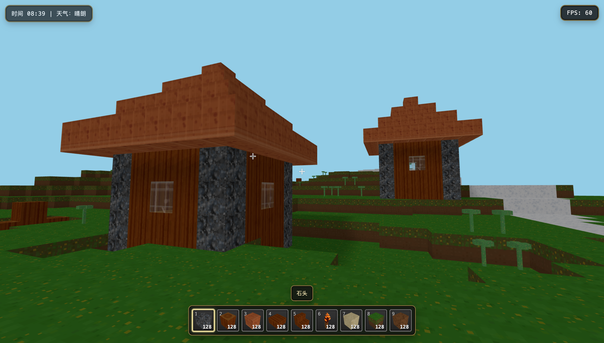
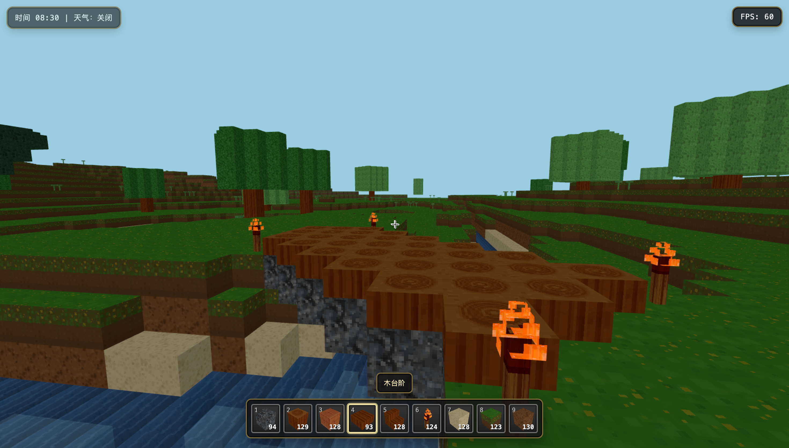

# 🧱 Cellcraft

**一个受 Minecraft 启发的 3D 体素世界生成器**
基于 Three.js 构建，支持程序化地形、村庄生成、方块交互和天气系统

[**🌐 在线体验**](http://craft.mcell.top/) • [**📖 文档**](./CLAUDE.md) • [🎮 快速开始](#-快速开始)

---

⚠️ **免责声明**: 本项目仅为学习目的而创建，灵感来源于 Minecraft 概念。本项目**不隶属于** Mojang Studios 或 Microsoft，与 Minecraft 官方无关。所有"Minecraft"相关商标和版权归其各自所有者所有。本项目**不包含**任何原版游戏资源，仅使用程序生成的原创内容。请勿用于商业用途。

---

在随机生成的方块大陆里探索村庄、砍树建屋、点亮火把，感受日夜与雨雪变化。按 Esc 打开菜单，随时调节视距、像素比、阴影与天气，低配设备也能流畅冒险。

截图：

| HUD & 选项                          | 建筑                             | 生态                                      |
| ----------------------------------- | -------------------------------- | ----------------------------------------- |
|  |  |  |

## 🤝 开源贡献

- 欢迎 Issue 反馈：带上复现步骤、期望效果或截图。
- 提 PR 流程：Fork → 新建分支 → 提交改动 → 发起 PR，简述变更与测试方式。
- 有想法先讨论：可开草稿 PR 或在 Issue 中写下设计/性能/玩法提案。

## 📜 许可证

本项目采用 MIT License，详见 `LICENSE`。署名保留，欢迎学习与二次创作。
